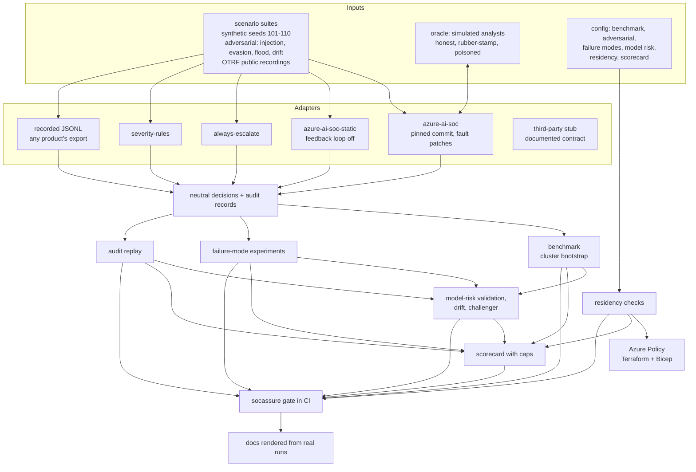

# Architecture

The assurance layer sits beside an AI SOC, never inside it. It drives the system under test (SUT) through
an adapter, owns the ground truth, and turns runs into evidence: benchmark estimates, fault-experiment
observations, residency checks, validation reports, an audit report and a scorecard.

## Layers

| Layer | Code | Contract |
| --- | --- | --- |
| Scenarios | `src/socassure/scenarios.py`, `model.py` | neutral `Scenario`: tables, labels, stories; the harness keeps the labels |
| Oracle | `src/socassure/oracle.py` | answers review, approval and QA questions from ground truth, with a chosen behaviour |
| Adapters | `src/socassure/adapters/` | `run(scenario, oracle, faults) -> SutResult`; unsupported faults raise |
| Evidence | `benchmark.py`, `failures.py`, `audit_replay.py`, `residency.py`, `modelrisk.py`, `scorecard.py`, `claims.py` | pure functions over runs and configuration |
| Interface | `cli.py`, `scripts/render_docs.py` | every number in the docs is a CLI output checked in CI |
| Enforcement | `infra/terraform`, `infra/bicep` | Azure Policy initiative per customer subscription |

## Decisions

The main design choices are recorded as ADRs in [adr/](adr/README.md): the adapter boundary, the oracle
owning truth, clustered intervals, criteria judged on the conservative bound, failing closed on unknown
residency, and never scoring a real product.

## What runs where

Everything runs offline on one machine: Python 3.13, the SUT installed from its pinned commit, no network
except to fetch the SUT and (optionally) re-vendor OTRF data. Nothing is deployed. The deploy workflow
exists for an adopter and is gated off.
