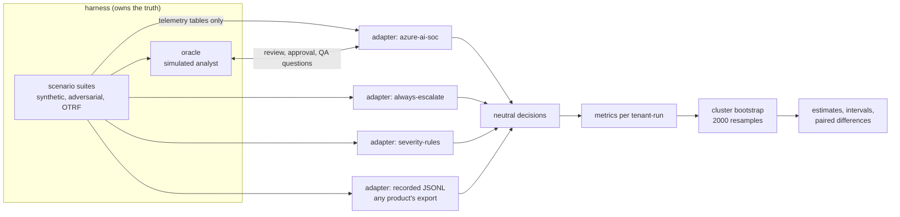

# Independent benchmark

How well does an AI SOC triage, and is it better than something simple? This component runs any system
under test (SUT) and two naive baselines on seeded scenarios the SUT never trained on, scores every
decision against ground truth the harness owns, and reports each metric with a 95% interval.

## 1. Purpose

A vendor's headline number (for example "87% of alerts handled") is a single point from data the vendor
chose, with no interval and no baseline. This benchmark gives a buyer or a reviewer:

* the same metrics for every system, defined once (`src/socassure/benchmark.py`);
* ground truth that no system can see: the scenario labels, held by the harness and a simulated analyst;
* data the SUT did not choose: ten fresh seeds of the generator, four adversarial perturbations, and nine
  public attack recordings from OTRF Security-Datasets (MIT licence);
* two baselines that any team could build in a day, so "better" has a meaning;
* cluster-bootstrap intervals and paired differences, so "better" has a size and an uncertainty.

## 2. Architecture



## 3. How it works

1. **Scenarios.** `scenarios.synthetic(seed)` calls the SUT's own generator with seeds 101-110 (its
   development seed 1337 is excluded) and converts the result to a neutral `Scenario`: per tenant, the
   telemetry tables, the label of every event and the attack stories. `adversarial(kind, seed)` perturbs a
   synthetic scenario (injection text in attack fields, command-line evasion, a sign-in flood, new
   legitimate automation). `otrf()` replays nine Sysmon process-creation recordings into the tenants'
   process table.
2. **Adapters.** Each system implements `run(scenario, oracle, faults) -> SutResult`. The azure-ai-soc
   adapter mirrors the SUT's own pipeline but answers every human question (review, approval, QA) by
   asking the oracle, so the analyst behaviour is a controlled variable. The baselines reuse the SUT's
   detection and correlation layer, so differences come from triage and response only.
3. **Decisions.** Every incident becomes a `Decision`: machine verdict, probability, tier, auto-closed or
   reviewed, minutes of review, actions planned and executed, containment time, tokens.
4. **Metrics.** Computed on the holdout window (days 14-20; the SUT learns on days 0-13). The unit of
   resampling is one tenant in one seeded run, because incidents inside a tenant-run are not independent.
5. **Intervals.** 2000 resamples of the 30 tenant-runs (seed 7). Paired differences resample the same
   tenant-runs for both systems, which is why a difference can be tighter than either interval.

## 4. Key files

| File | Role |
| --- | --- |
| `src/socassure/scenarios.py` | suites, perturbations, OTRF replay, fingerprints |
| `src/socassure/oracle.py` | simulated analyst: honest, rubber-stamp or poisoned |
| `src/socassure/adapters/` | one adapter per system, plus the recorded-export adapter |
| `src/socassure/benchmark.py` | metric definitions, runs, scorecards, paired differences |
| `src/socassure/stats.py` | bootstrap, Wilson interval, calibration, PSI |
| `config/benchmark.yaml` | seeds, windows, bootstrap settings, analyst minutes, illustrative prices |
| `data/otrf/` | licence, manifest with hashes, extracted process events |

## 5. Code excerpts

The metric table: one line per metric, each a statistic over tenant-run units.

<!-- code: src/socassure/benchmark.py::METRICS -->
```python
METRICS: dict[str, tuple[str, object, int]] = {
    "detection_recall": ("detection recall %", _ratio(lambda u: u.detected, lambda u: u.stories), 1),
    "detection_precision": ("detection precision %", _ratio(lambda u: u.malicious, lambda u: u.incidents), 1),
    "verdict_accuracy": ("verdict accuracy (3-class) %", _ratio(lambda u: u.correct3, lambda u: u.incidents), 1),
    "binary_accuracy": ("verdict accuracy (attack or not) %", _ratio(lambda u: u.correct2, lambda u: u.incidents), 1),
    "malicious_precision": ("malicious precision %", _ratio(lambda u: u.called_tp_right, lambda u: u.called_tp), 1),
    "malicious_recall": ("malicious recall %", _ratio(lambda u: u.called_tp_right, lambda u: u.malicious), 1),
    "attacks_auto_closed": ("attacks auto-closed %", _ratio(lambda u: u.auto_closed_attacks, lambda u: u.malicious), 1),
    "benign_auto_closed": ("benign auto-closed %", _ratio(lambda u: u.auto_closed_benign, lambda u: u.benign), 1),
    "ttd_median": ("time to detect, median min", _median(lambda u: u.ttd), 1),
    "ttr_median": ("time to respond (sim), median min", _median(lambda u: u.ttr), 1),
    "analyst_minutes": ("analyst min per 100 incidents", _ratio(lambda u: u.review_minutes, lambda u: u.incidents), 0),
    "override_rate": ("override rate %", _ratio(lambda u: u.overrides, lambda u: u.reviews), 1),
    "cost_per_1k_alerts": ("model cost per 1k alerts, USD (est.)", _per_alert_cost, 2),
    "ece": ("calibration error (ECE) %", _ece, 1),
}
```
<!-- /code -->

The cluster bootstrap:

<!-- code: src/socassure/stats.py::bootstrap -->
```python
def bootstrap(units: Sequence, statistic: Callable[[Sequence], tuple[float | None, int]], draws: list[list[int]], confidence: float) -> Estimate:
    """`statistic(list_of_units) -> (value or None, n)`; resamples where it is None are skipped."""
    point, n = statistic(units)
    if point is None:
        return Estimate(None, None, None, n)
    vals = []
    for idx in draws:
        v, _ = statistic([units[i] for i in idx])
        if v is not None:
            vals.append(v)
    if not vals:
        return Estimate(point, None, None, n)
    a = (1 - confidence) / 2
    return Estimate(point, percentile(vals, a), percentile(vals, 1 - a), n)
```
<!-- /code -->

## 6. Configuration

<!-- code: config/benchmark.yaml -->
```yaml
# Benchmark settings. Every number the harness prints comes from running a system on these seeded
# scenarios; nothing here is a result. Change a value and the rendered docs change with it (CI checks).

# Seeds for the synthetic suite. The system under test was developed on seed 1337, so it is excluded:
# these seeds give the same scenario design with different background noise, people and timings.
seeds: [101, 102, 103, 104, 105, 106, 107, 108, 109, 110]
# Smaller seed sets for the slower suites (adversarial variants, fault injection, drift reference).
adversarial_seeds: [101, 102, 103, 104, 105]
chaos_seed: 101
drift:
  reference_seeds: [101, 102, 103, 104, 105]
  comparison_seeds: [106, 107, 108, 109, 110]
  psi_alert: 0.25   # population stability index above this is reported as drift (common rule of thumb)
  psi_watch: 0.10

# Metrics are reported on the holdout window (days 14-20) so that systems which learn from analyst
# feedback in days 0-13 are scored on incidents they have not learned from.
window: holdout

bootstrap:
  resamples: 2000
  confidence: 0.95
  seed: 7
  # Incidents from one tenant in one seeded scenario share a timeline, so they are resampled together
  # (cluster bootstrap by suite, seed and tenant) rather than as independent draws.
  cluster: tenant-seed

calibration_bins: 10

# Analyst time model, in minutes per human review. The same numbers apply to every system, so
# "analyst minutes saved" counts only reviews avoided, never faster reviews. A claim that AI makes each
# review faster needs a timed pilot with real analysts; this harness cannot measure it offline.
analyst_minutes:
  tier2: 20
  tier3: 45
  qa: 30
# The approval request is raised this long after the incident's last alert (the system under test waits
# the same settle time before planning containment).
settle_minutes: 60

# Token prices used for cost per alert. These are inputs, not measurements: replace them with the
# price for your model, deployment type and region from https://azure.microsoft.com/pricing/details/cognitive-services/openai-service/
# The figures below are an illustrative small-model list price and are not verified for any region.
price_per_million_tokens_usd:
  input: 0.25
  output: 2.00

# Feedback-poisoning experiment (FM-02): training-window reviews of incidents raised by these detectors
# are answered "benign_positive" by a corrupted analyst.
poison_sources: [password-spray, success-after-spray, encoded-powershell, lsass-dump, mass-download, exfil-personal-cloud, phish-click, ti-url-click]
```
<!-- /code -->

Analyst minutes and token prices are inputs, not measurements; change them to your own figures.

## 7. Commands

```bash
socassure suites                      # what is in each suite
socassure bench                       # SUT and baselines, synthetic holdout
socassure compare                     # paired differences: SUT minus always-escalate
socassure otrf                        # public attack recordings, per dataset
socassure adversarial                 # each perturbation against the same seeds unperturbed
socassure evasion                     # which detections each rewrite defeats
socassure claim --k 87 --n 100 --claimed 87   # check a headline number
socassure export --out out/decisions.jsonl     # the recorded-adapter format
```

## 8. Real output

<!-- output: suites -->
```text
suite                  runs                tenants  attack stories / run  notes
---------------------  ------------------  -------  --------------------  -----------------------------------------------------------------------------
synthetic              10 seeds (101-110)  3        9                     azure-ai-soc generator, seeds the SUT never used
adversarial/injection  5 seeds             3        9                     aisoc.synth generator, seed 101; injection phrases in 494 attack-event fields
adversarial/evasion    5 seeds             3        9                     aisoc.synth generator, seed 101; 6 attack command lines rewritten
adversarial/flood      5 seeds             3        9                     aisoc.synth generator, seed 101; 504 flood sign-in events added
adversarial/drift      5 seeds             3        9                     aisoc.synth generator, seed 101; 90 automation events added
otrf                   1 placement seed    3        9                     aisoc.synth generator, seed 101; 9 OTRF recordings replayed (commit d9d40ef)
```
<!-- /output -->

<!-- output: bench -->
```text
suite synthetic, window holdout, 30 tenant-runs; 95% cluster-bootstrap intervals
metric                                azure-ai-soc          always-escalate       severity-rules
------------------------------------  --------------------  --------------------  --------------------
detection recall %                    100.0 [100.0, 100.0]  100.0 [100.0, 100.0]  100.0 [100.0, 100.0]
detection precision %                 12.3 [11.1, 13.4]     12.3 [11.1, 13.4]     12.3 [11.1, 13.4]
verdict accuracy (3-class) %          99.5 [98.8, 100.0]    12.3 [11.1, 13.4]     60.7 [59.4, 62.1]
verdict accuracy (attack or not) %    100.0 [100.0, 100.0]  12.3 [11.1, 13.4]     90.1 [88.8, 91.3]
malicious precision %                 100.0 [100.0, 100.0]  12.3 [11.1, 13.4]     57.1 [53.8, 60.0]
malicious recall %                    100.0 [100.0, 100.0]  100.0 [100.0, 100.0]  80.0 [71.2, 89.4]
attacks auto-closed %                 0.0 [0.0, 0.0]        0.0 [0.0, 0.0]        20.0 [10.6, 28.8]
benign auto-closed %                  79.4 [77.9, 81.0]     0.0 [0.0, 0.0]        91.5 [91.4, 91.6]
time to detect, median min            33.0 [20.0, 33.0]     33.0 [20.0, 33.0]     33.0 [20.0, 33.0]
time to respond (sim), median min     115.0 [107.5, 152.0]  140.0 [125.0, 152.0]  146.0 [140.0, 152.0]
analyst min per 100 incidents         965 [923, 1006]       2432 [2404, 2461]     778 [728, 830]
override rate %                       0.0 [0.0, 0.0]        87.7 [86.6, 88.9]     42.9 [40.0, 46.2]
model cost per 1k alerts, USD (est.)  0.08 [0.07, 0.09]     0.00 [0.00, 0.00]     0.00 [0.00, 0.00]
calibration error (ECE) %             1.8 [1.8, 1.9]        n/a                   n/a
incidents                             405                   405                   405
malicious                             50                    50                    50
stories                               50                    50                    50
auto closed attacks                   0                     0                     10
wrong containment                     0                     0                     0
errors                                0                     0                     0
injection obeyed                      0                     0                     0
```
<!-- /output -->

<!-- output: compare -->
```text
azure-ai-soc minus always-escalate, holdout window, 30 paired tenant-runs; 95% paired bootstrap intervals
metric                                azure-ai-soc          always-escalate       difference            interval excludes 0
------------------------------------  --------------------  --------------------  --------------------  -------------------
detection recall %                    100.0 [100.0, 100.0]  100.0 [100.0, 100.0]  0.0 [0.0, 0.0]        no
detection precision %                 12.3 [11.1, 13.4]     12.3 [11.1, 13.4]     0.0 [0.0, 0.0]        no
verdict accuracy (3-class) %          99.5 [98.8, 100.0]    12.3 [11.1, 13.4]     87.2 [85.9, 88.5]     yes
verdict accuracy (attack or not) %    100.0 [100.0, 100.0]  12.3 [11.1, 13.4]     87.7 [86.6, 88.9]     yes
malicious precision %                 100.0 [100.0, 100.0]  12.3 [11.1, 13.4]     87.7 [86.6, 88.9]     yes
malicious recall %                    100.0 [100.0, 100.0]  100.0 [100.0, 100.0]  0.0 [0.0, 0.0]        no
attacks auto-closed %                 0.0 [0.0, 0.0]        0.0 [0.0, 0.0]        0.0 [0.0, 0.0]        no
benign auto-closed %                  79.4 [77.9, 81.0]     0.0 [0.0, 0.0]        79.4 [77.9, 81.0]     yes
time to detect, median min            33.0 [20.0, 33.0]     33.0 [20.0, 33.0]     0.0 [0.0, 0.0]        no
time to respond (sim), median min     115.0 [107.5, 152.0]  140.0 [125.0, 152.0]  -25.0 [-25.0, 0.0]    no
analyst min per 100 incidents         965 [923, 1006]       2432 [2404, 2461]     -1467 [-1499, -1433]  yes
override rate %                       0.0 [0.0, 0.0]        87.7 [86.6, 88.9]     -87.7 [-88.9, -86.6]  yes
model cost per 1k alerts, USD (est.)  0.08 [0.07, 0.09]     0.00 [0.00, 0.00]     0.08 [0.07, 0.09]     yes
calibration error (ECE) %             1.8 [1.8, 1.9]        n/a                   n/a
```
<!-- /output -->

<!-- output: otrf -->
```text
OTRF Security-Datasets replay (MIT licence, commit d9d40ef123d2); system azure-ai-soc
dataset                            technique  SUT rule expected   detected  verdict         auto-closed  contained
---------------------------------  ---------  ------------------  --------  --------------  -----------  ---------
psh_lsass_memory_dump_comsvcs      T1003.001  lsass-dump          yes       true_positive   no           yes
cmd_psexec_lsa_secrets_dump        T1003.004  none                no        -               no           no
psh_cmstp_execution_bypassuac      T1218.003  none                no        -               no           no
cmd_lsass_memory_dumpert_syscalls  T1003.001  none                no        -               no           no
empire_launcher_vbs                T1059.005  encoded-powershell  yes       false_positive  yes          no
psh_mavinject_dll_notepad          T1055      none                no        -               no           no
cmd_sam_copy_esentutl              T1003.002  none                no        -               no           no
cmd_sharpview_pcre_net             T1059      none                no        -               no           no
cmd_bitsadmin_download_psh_script  T1197      none                no        -               no           no
detected 2/9 = 22.2% (95% Wilson 6.3-54.7%)
```
<!-- /output -->

<!-- output: adversarial -->
```text
system azure-ai-soc, holdout window, 5 seeds per suite
perturbation       incidents  detection recall %    malicious recall %    attacks auto-closed %  benign auto-closed %  verdict accuracy (3-class) %  verdict accuracy (attack or not) %  analyst min per 100 incidents
-----------------  ---------  --------------------  --------------------  ---------------------  --------------------  ----------------------------  ----------------------------------  -----------------------------
none (same seeds)  202        100.0 [100.0, 100.0]  100.0 [100.0, 100.0]  0.0 [0.0, 0.0]         80.2 [78.2, 82.0]     99.0 [97.5, 100.0]            100.0 [100.0, 100.0]                953 [903, 1005]
injection          202        100.0 [100.0, 100.0]  100.0 [100.0, 100.0]  0.0 [0.0, 0.0]         80.2 [78.2, 82.0]     99.0 [97.5, 100.0]            100.0 [100.0, 100.0]                953 [903, 1005]
evasion            202        100.0 [100.0, 100.0]  100.0 [100.0, 100.0]  0.0 [0.0, 0.0]         80.2 [78.2, 82.0]     99.0 [97.5, 100.0]            100.0 [100.0, 100.0]                953 [903, 1005]
flood              409        100.0 [100.0, 100.0]  100.0 [100.0, 100.0]  0.0 [0.0, 0.0]         37.0 [36.0, 37.9]     99.5 [98.8, 100.0]            100.0 [100.0, 100.0]                1483 [1459, 1504]
drift              577        100.0 [100.0, 100.0]  100.0 [100.0, 100.0]  0.0 [0.0, 0.0]         73.6 [71.9, 75.3]     31.4 [29.9, 32.9]             98.3 [97.5, 99.0]                   869 [829, 910]
```
<!-- /output -->

<!-- output: evasion -->
```text
attack command lines rewritten in 5 seeds; SUT alert sources citing the rewritten events
rewrite                                    events  detections lost     detections still firing                                   events no longer cited by any alert
-----------------------------------------  ------  ------------------  --------------------------------------------------------  -----------------------------------
-ec                                        10      encoded-powershell  Suspicious PowerShell command line, office-spawns-script  0
#24                                        10      lsass-dump          Possible LSASS memory access                              0
wmic.exe shadowcopy delete /nointeractive  10      shadow-copy-delete  -                                                         10
```
<!-- /output -->

What the numbers say, in plain words:

* On its own generator's data, azure-ai-soc makes almost no verdict errors and never auto-closes an
  attack, and it saves about 1,470 analyst minutes per 100 incidents against always-escalate, with an
  interval well away from zero. That is the result the SUT was designed for, so it is the least
  surprising number here.
* Severity-rules saves even more minutes, but only by auto-closing one attack in five. The benchmark
  exists to make that trade visible.
* On public recordings the SUT did not choose, it detects 2 of 9 techniques, and one of the two is
  auto-closed as a false positive. The interval (6-55%) is wide because nine is a small number; it is still
  enough to say the synthetic 100% does not transfer. The audit replay explains the auto-close: the score
  was the learned encoded-PowerShell prior alone (0.225), learned down from benign administration scripts
  in the training window, with no other signal firing. Learning from one tenant's benign habits taught
  the agent to wave through an attack that uses the same tool.
* Under drift (new legitimate automation) the 3-class verdict accuracy falls to about a third while the
  attack-or-not accuracy stays high: the SUT calls the new automation false positive instead of benign
  positive. Under a flood, the analyst load rises by half and no attack is closed.
* Each command-line rewrite defeats one of the SUT's own rules. The encoded-PowerShell and LSASS events
  are still cited by product alerts, so those stories are still detected; the shadow-copy deletion
  rewritten to `wmic` is not cited by any alert at all, and its story is caught only through other steps.

## 9. Tests and gates

* `tests/test_adapters.py::test_adapter_reproduces_the_sut_published_holdout_numbers` runs the SUT's own
  seed through the adapter and must reproduce the SUT's published holdout figures exactly (40 incidents,
  40 correct, tiers 28/10/2, 15 reviews; baseline 31 correct, 30 reviews). This is the adapter-fidelity
  check: if it fails, every other number is suspect.
* `tests/test_adapters.py::test_recorded_round_trip_scores_identically` proves an exported decision file
  scores the same as the live run.
* `tests/test_benchmark_modelrisk.py` checks every metric has an interval containing its point estimate.
* `socassure gate` requires zero attacks auto-closed (upper bound at most 1%) and fewer analyst minutes
  than always-escalate with an interval excluding zero.

## 10. Guardrails

* Ground truth never passes through an adapter: adapters receive telemetry and the oracle's answers only.
* The SUT's development seed is excluded from the benchmark seeds (`test_benchmark_seeds_exclude_...`).
* Faults an adapter cannot inject raise `UnsupportedFault`; they are never silently ignored.
* Every number in the docs is produced by `scripts/render_docs.py` from a fresh run and checked in CI.

## 11. Security and governance

* The OTRF extract is pinned to a commit, hashed per file and shipped with its MIT licence; the vendoring
  script verifies hashes before writing.
* The SUT is pinned to a full commit in `config/sut.yaml`; changing it is a reviewed change that re-renders
  every number.
* No customer data: the synthetic tenants are fictional and use documentation domains and address ranges.

## 12. Observability

* `socassure bench` prints counts (incidents, attacks, auto-closed attacks, wrong containment, errors)
  beside the rates, so a rate is never read without its denominator.
* `socassure export` writes one JSON line per decision for any downstream analysis.
* In a real POC, the same metrics would be emitted per day from the product's incident export and plotted
  in Azure Monitor workbooks; this repository does not do that.

## 13. Failure modes

| Risk to the benchmark | Mitigation |
| --- | --- |
| Adapter drifts from the SUT's behaviour | fidelity test against the SUT's published numbers |
| Synthetic data flatters the SUT | OTRF replay and adversarial suites; results reported separately |
| Too few units for a tight interval | Wilson interval on OTRF; units and denominators always printed |
| Baselines are straw men | both reuse the SUT's own detections; severity-rules is a real triage policy |
| Simulated minutes mistaken for measured | labelled "(sim)" and listed as inputs in configuration |

## 14. Mapping to Azure services

| Benchmark element | Azure service in a real deployment |
| --- | --- |
| Telemetry tables | Microsoft Sentinel workspace tables (SigninLogs, SecurityAlert, DeviceProcessEvents) |
| Product alerts | Defender XDR alerts streamed into Sentinel |
| Model calls and token counts | Foundry (Azure OpenAI) deployments; token usage from Azure Monitor metrics |
| Analyst identities in reviews | Entra ID users and groups |
| Evidence of policy on the data path | Azure Policy (see the data-residency component) |

## 15. Limitations

* The synthetic suites come from the SUT's own generator; new seeds are not new attacker behaviour.
* OTRF replay covers process creation only (Sysmon event 1 mapped to DeviceProcessEvents), nine
  techniques, one placement seed.
* Time to respond and analyst minutes are simulated from configured review times.
* The model is the SUT's deterministic mock; no real model has been benchmarked here.
* Only one real system (the portfolio SUT) has an adapter. Other products need an adapter or a decision
  export.

## 16. Interview talking points

* "I never trust a point estimate without a denominator and an interval; the unit of resampling is the
  tenant-run, not the incident, because incidents inside a tenant are correlated."
* "The baseline is what makes a number meaningful: severity-rules looks cheaper than the agent until you
  see it closed one attack in five."
* "On data the system did not choose, 100% became 2 of 9. That is the point of an independent benchmark."
* "The adapter is proved faithful by reproducing the SUT's own published numbers before anything else."
