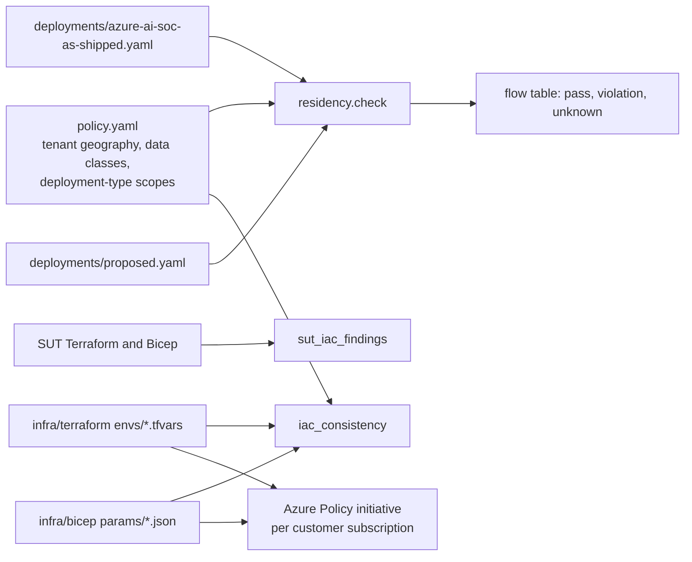

# Data residency

Where does each customer's security data go when an AI SOC processes it, and what stops it going
somewhere else? This component models residency as policy, checks every data flow and model endpoint of a
deployment against it, reads the system under test's own infrastructure code, and ships Azure Policy in
Terraform and Bicep that enforces the result.

## 1. Purpose

An AI SOC moves customer telemetry through more places than a classic SIEM: the workspace, the agent
runtime, the model endpoint, the prompt-screening service, the audit store, and the people who read the
incidents. Each can sit in a different region, and model deployments add a twist: the deployment type,
not the resource's region, decides where prompts are processed. This component makes those flows explicit
per tenant, checks them, and turns the answer into enforceable policy.

## 2. Architecture



## 3. How it works

1. **Policy.** Each tenant has a home geography and a flag for whether data-zone processing is acceptable.
   Each data class has a scope: telemetry, pseudonymised prompt evidence and audit records must stay in
   the tenant geography; shared threat intelligence and aggregate metrics may go anywhere.
2. **Flows.** Eight flows per tenant (telemetry into the workspace, agents reading it, prompts to the
   model, prompt screening, audit storage, analysts viewing incidents, threat-intel feed, reporting).
3. **Resolution.** A region resolves to its geography. A model endpoint resolves through its deployment
   type: global types may process in any region, data-zone types within the data zone of the resource's
   region, Standard and regional provisioned types within the region's geography. An unset type or an
   unknown region is `unknown`, which counts as a failure.
4. **Checks.** Each flow passes or fails with a reason. Human access from another country is reported as
   cross-border access.
5. **Enforcement.** The proposed layout is turned into per-tenant Azure Policy parameters (allowed regions,
   allowed deployment SKUs, effect `Deny`), and a test proves the Terraform and Bicep parameters both
   enforce the policy and agree with each other.

## 4. Key files

| File | Role |
| --- | --- |
| `config/residency/policy.yaml` | geographies, data zones, deployment-type scopes, data classes, tenants, flows |
| `config/residency/deployments/` | where each flow lands, as shipped and as proposed |
| `src/socassure/residency.py` | flow checks, SUT IaC reading, IaC consistency |
| `infra/terraform/main.tf` | four policy definitions, an initiative and a subscription assignment |
| `infra/bicep/main.bicep` | the same at subscription scope in Bicep |
| `docs/residency/deployment-types.md` | what each deployment type means for processing location, with Microsoft links |

## 5. Code excerpts

How a model endpoint's processing location is resolved:

<!-- code: src/socassure/residency.py::_resolve -->
```python
def _resolve(where, pol: dict) -> tuple[str, str]:
    """(processed-in description, resolved geography or 'global' / 'unknown')."""
    if isinstance(where, dict):  # model endpoint
        region, dtype = where.get("region"), where.get("deployment_type")
        scope = pol["deployment_types"].get(dtype)
        geo = geography_of(region) if region else None
        if scope is None:
            return f"{region} ({dtype or 'type not set'})", "unknown"
        if scope == "global":
            return f"{region} {dtype}: any Azure region", "global"
        if scope == "data_zone":
            zone = pol["geographies"].get(geo, {}).get("data_zone") if geo else None
            if not zone:
                return f"{region} {dtype}: no data zone for this region", "unknown"
            return f"{region} {dtype}: {zone} data zone", f"zone:{zone}"
        return f"{region} {dtype}: {geo}", geo or "unknown"
    if where == "global":
        return "global service", "global"
    if where in pol["geographies"]:
        return where, where
    geo = geography_of(str(where))
    return f"{where} ({geo or 'unknown region'})", geo or "unknown"
```
<!-- /code -->

The subscription assignment in Terraform (the four rules are in `local.rules` in the same file):

<!-- code: infra/terraform/main.tf::resource "azurerm_subscription_policy_assignment" "residency" -->
```hcl
resource "azurerm_subscription_policy_assignment" "residency" {
  name                 = local.prefix
  display_name         = "SOC data residency (${var.tenant_slug})"
  subscription_id      = data.azurerm_subscription.current.id
  policy_definition_id = azurerm_policy_set_definition.residency.id
  enforce              = var.policy_effect != "Disabled"
  parameters = jsonencode({
    effect                 = { value = var.policy_effect }
    allowedLocations       = { value = var.allowed_locations }
    allowedDeploymentTypes = { value = var.allowed_model_deployment_types }
  })
  non_compliance_message {
    content = "Blocked by SOC data residency for ${var.tenant_slug}: allowed regions ${join(", ", var.allowed_locations)}; allowed model deployment types ${join(", ", var.allowed_model_deployment_types)}."
  }
}
```
<!-- /code -->

## 6. Configuration

<!-- code: config/residency/deployments/proposed.yaml -->
```yaml
# A residency-aware layout this repository proposes. US tenants use a US data-zone model deployment;
# the Canadian tenant keeps everything in Canadian regions with a geography (Standard) deployment and a
# Canada-based on-call analyst group. Whether a given model offers Standard deployments in canadaeast
# must be checked on the model availability page before relying on this (verified: false).
name: proposed residency-aware layout
tenants:
  brightwater:
    workspace: eastus2
    agents: eastus2
    model: { region: eastus2, deployment_type: DataZoneStandard }
    content_safety: eastus2
    audit: eastus2
    analysts: united-states
    threat_intel: global
    reporting: global
  orchidvalley:
    workspace: canadacentral
    agents: canadacentral
    model: { region: canadaeast, deployment_type: Standard, verified: false }
    content_safety: canadacentral
    audit: canadacentral
    analysts: canada
    threat_intel: global
    reporting: global
  pinecrest:
    workspace: centralus
    agents: centralus
    model: { region: eastus2, deployment_type: DataZoneStandard }
    content_safety: centralus
    audit: centralus
    analysts: united-states
    threat_intel: global
    reporting: global
```
<!-- /code -->

Per-tenant policy parameters, for example the Canadian tenant:

<!-- code: infra/terraform/envs/orchidvalley.tfvars -->
```text
# Orchid Valley Clinics: Canada. No Canada-only data zone exists, so only geography (Standard /
# regional provisioned) model deployments are allowed.
tenant_slug                    = "orchidvalley"
allowed_locations              = ["canadacentral", "canadaeast"]
allowed_model_deployment_types = ["Standard", "ProvisionedManaged"]
policy_effect                  = "Deny"
```
<!-- /code -->

## 7. Commands

```bash
socassure residency                                  # every deployment, failures only
socassure residency --deployment proposed --all      # one deployment, every flow
socassure iac                                        # policy parameters vs residency policy
terraform -chdir=infra/terraform init -backend=false && terraform -chdir=infra/terraform test
bicep build infra/bicep/main.bicep
```

## 8. Real output

<!-- output: residency -->
```text
azure-ai-soc as shipped: 24 flow checks, 16 pass, 5 violation, 3 unknown
tenant        flow  what                                   processed in             allowed                            result     why
------------  ----  -------------------------------------  -----------------------  ---------------------------------  ---------  ---------------------------------------------------------------
brightwater   F3    prompts to the model endpoint          eastus2 (unset)          united-states (data zone allowed)  unknown    processing location cannot be established; treated as a failure
orchidvalley  F1    telemetry into the Sentinel workspace  eastus2 (united-states)  canada                             violation  united-states is outside canada
orchidvalley  F2    agents read the workspace              eastus2 (united-states)  canada                             violation  united-states is outside canada
orchidvalley  F3    prompts to the model endpoint          eastus2 (unset)          canada                             unknown    processing location cannot be established; treated as a failure
orchidvalley  F4    prompt screening (Content Safety)      eastus2 (united-states)  canada                             violation  united-states is outside canada
orchidvalley  F5    audit chain storage                    eastus2 (united-states)  canada                             violation  united-states is outside canada
orchidvalley  F6    analysts view incidents                united-states            canada                             violation  united-states is outside canada (cross-border access)
pinecrest     F3    prompts to the model endpoint          eastus2 (unset)          united-states (data zone allowed)  unknown    processing location cannot be established; treated as a failure

proposed residency-aware layout: 24 flow checks, 24 pass, 0 violation, 0 unknown

system under test infrastructure code (regions it can be deployed to, by tenant geography):
tenant        regions                                                                result
------------  ---------------------------------------------------------------------  -----------------------------------
all           Terraform accepts eastus2, westus2, westeurope; Bicep default eastus2  info
brightwater   eastus2, westus2                                                       deployable in geography
orchidvalley  none                                                                   cannot be deployed in its geography
pinecrest     eastus2, westus2                                                       deployable in geography
```
<!-- /output -->

<!-- output: iac -->
```text
tenant        stack      enforces policy  detail
------------  ---------  ---------------  ----------------------------------------------------------------------------------------------------------------------
brightwater   terraform  yes              5 regions, types ['DataZoneBatch', 'DataZoneProvisionedManaged', 'DataZoneStandard', 'ProvisionedManaged', 'Standard']
brightwater   bicep      yes              5 regions, types ['DataZoneBatch', 'DataZoneProvisionedManaged', 'DataZoneStandard', 'ProvisionedManaged', 'Standard']
orchidvalley  terraform  yes              2 regions, types ['ProvisionedManaged', 'Standard']
orchidvalley  bicep      yes              2 regions, types ['ProvisionedManaged', 'Standard']
pinecrest     terraform  yes              5 regions, types ['DataZoneBatch', 'DataZoneProvisionedManaged', 'DataZoneStandard', 'ProvisionedManaged', 'Standard']
pinecrest     bicep      yes              5 regions, types ['DataZoneBatch', 'DataZoneProvisionedManaged', 'DataZoneStandard', 'ProvisionedManaged', 'Standard']
```
<!-- /output -->

What it means:

* The SUT as shipped would put the Canadian clinic group's telemetry, agents, prompt screening and audit
  records in a US region, and its analysts would view the incidents from the United States. Its Terraform
  only accepts `eastus2`, `westus2` or `westeurope`, so it cannot be placed in Canada without a code change.
* For every tenant the model deployment type is not set anywhere in the SUT, so where prompts are
  processed cannot be established. That is reported as unknown and treated as a failure: an unpinned
  deployment could be Global.
* The proposed layout passes every check: US tenants use a US data-zone deployment, the Canadian tenant
  uses Canadian regions and a Standard (geography) deployment, with a Canada-based analyst group. Whether a
  given model is offered as Standard in a Canadian region is unverified here and must be checked.

## 9. Tests and gates

* `tests/test_residency.py`: the shipped layout fails exactly the Canadian tenant and the unpinned model
  type; the proposed layout passes; Global types violate geography-bound data; a data zone needs tenant
  consent and a matching zone; unknown regions fail closed; the SUT's IaC cannot place the Canadian tenant;
  Terraform and Bicep parameters enforce the policy and agree.
* `tests/test_iac_and_workflows.py`: both stacks define the same four rules, reject Global types at the
  variable or parameter level, default to `Deny`, and create only policy resources.
* `infra/terraform/tests/plan.tftest.hcl`: mocked-provider plans for the Canadian tenant, a rejected Global
  type and the disabled effect. CI also runs `tflint`, `checkov` and `bicep build`.
* `socassure gate`: the proposed layout must pass and all six parameter sets must enforce the policy.

## 10. Guardrails

* Fail closed: anything the checker cannot place is a failure, not a pass.
* The Terraform variable and the Bicep template both refuse Global and Developer deployment types, so the
  policy cannot be weakened by a parameter file alone.
* The initiative starts in `Deny`; `Audit` exists for a first look at an existing subscription.

## 11. Security and governance

* Residency choices are legal decisions. The Canadian requirement in this scenario is an assumption marked
  `verified: false`, not legal advice.
* Microsoft's processing statements are linked, not restated as commitments; see
  [deployment types](../residency/deployment-types.md), which marks what this repository has not verified.
* The analysts flow matters as much as the data flows: an MSSP's follow-the-sun model is cross-border
  access even when every byte is stored in-region.

## 12. Observability

Once assigned, Azure Policy compliance results show every non-compliant resource per subscription, and
denied requests appear in the Azure activity log; both can be sent to Azure Monitor and alerted on. Run
`socassure residency` in CI against the deployment description whenever infrastructure changes.

## 13. Failure modes

| Failure | Effect | Mitigation |
| --- | --- | --- |
| Model deployed as Global to get quota | prompts processed in any region | Azure Policy on `sku.name`; Terraform and Bicep refuse Global |
| New region added outside the geography | telemetry stored out of country | allowed-locations rule; Log Analytics rule |
| Analysts outside the country | cross-border access | per-tenant analyst groups in Entra ID; access reviews |
| Data zone expanded by the provider | processing location changes | review the Learn page; Standard deployments where a zone is not acceptable |
| Abuse-monitoring human review | samples may be read by reviewers | unverified here; read the abuse-monitoring page and consider the modified abuse monitoring option |

## 14. Mapping to Azure services

| Element | Azure service |
| --- | --- |
| Workspace region | Microsoft Sentinel on a Log Analytics workspace (Azure Monitor Logs) |
| Model processing location | Foundry deployment type (`sku.name`) |
| Prompt screening | Azure AI Content Safety, part of Foundry guardrails |
| Product alerts source | Defender XDR (its own data location is set per tenant; unverified here) |
| Analyst groups and access | Entra ID groups, Privileged Identity Management, access reviews |
| Enforcement | Azure Policy definitions, initiative and assignment per subscription |
| Evidence | Azure Policy compliance, Azure Monitor activity log |

## 15. Limitations

* Region lists are a working subset; check the Azure geographies page for your case.
* The checker trusts the deployment description; it does not read a live subscription. A real adopter
  would generate the description from Azure Resource Graph.
* Policy evaluates resource properties, not where a service internally processes data; it can only enforce
  what the service exposes (region and deployment type).
* Nothing here has been assigned to a real subscription.

## 16. Interview talking points

* "For model calls, the deployment type decides where prompts are processed, not the resource region. An
  unpinned deployment type is a residency finding, not a detail."
* "I model people as a flow: follow-the-sun analysts are cross-border access."
* "The policy lives in one YAML file; tests prove the Terraform and Bicep parameters enforce it and agree,
  and both stacks refuse Global types even if someone edits a parameter file."
* "The SUT cannot be deployed in Canada as written; the assurance layer found that by reading its own IaC."
