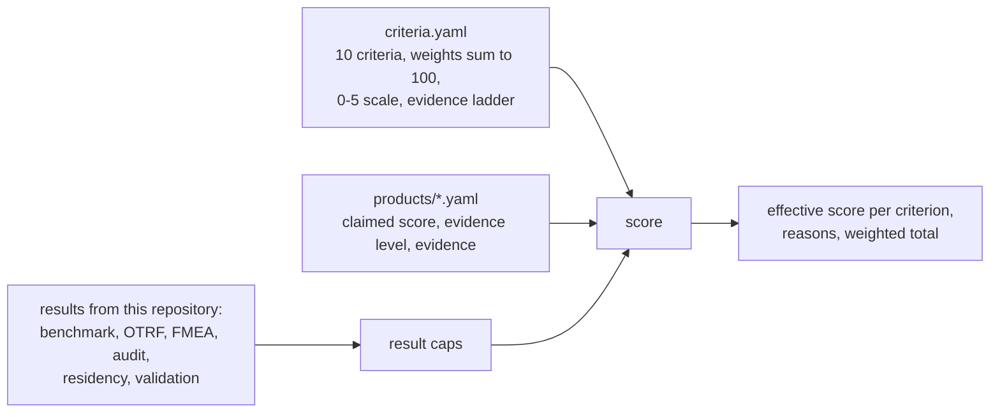

# Product scorecard

How do you compare AI SOC products when every vendor reports its own numbers? This component gives
weighted criteria, an evidence ladder that caps any score not backed by your own measurement, caps
computed from this repository's runs, a template for your POC, and an honest score for the one system it
has actually tested.

## 1. Purpose

Comparison tables in product material score the vendor's strengths with the vendor's evidence. This
scorecard does three things differently: it covers the gaps that matter to a buyer (independent results,
failure behaviour, residency, model risk, auditability) with explicit weights; it caps every score by the
quality of its evidence; and it never scores a real product it has not tested. Rows for real products are
there to be filled from your own POC.

## 2. Architecture



## 3. How it works

1. A product file gives each criterion a claimed score (0-5), an evidence level and a pointer to evidence.
2. The evidence level sets a ceiling: claimed by the vendor 1, documented 2, demonstrated on synthetic or
   vendor data 3, measured with intervals on data the vendor did not choose 4, measured on your own
   telemetry and reproduced 5.
3. Result caps lower the score further when this repository's runs contradict it (for example, detection
   quality is capped at 2 while public-recording recall is under half).
4. Total = sum over criteria of weight times effective score divided by 5, out of 100.
5. Products with no scores are listed as not scored, with a link to their public documentation.

## 4. Key files

| File | Role |
| --- | --- |
| `config/scorecard/criteria.yaml` | criteria, weights, scale, evidence ladder, which caps apply |
| `config/scorecard/template.yaml` | copy for a new product |
| `config/scorecard/products/` | the scored SUT and unscored real products |
| `src/socassure/scorecard.py` | caps from live results and the scoring rule |
| `src/socassure/claims.py` | checking a headline number and the questions to ask |

## 5. Code excerpts

<!-- code: src/socassure/scorecard.py::score -->
```python
def score(product: str) -> tuple[list[Row], float | None]:
    crit = criteria()
    p = products()[product]
    caps = cap_results(product)
    rows, total, any_scored = [], 0.0, False
    for c in crit["criteria"]:
        s = (p.get("scores") or {}).get(c["id"]) or {}
        claimed, level = s.get("score"), s.get("evidence_level", "claimed")
        reasons = []
        eff = claimed
        if claimed is not None:
            any_scored = True
            ceiling = crit["evidence_levels"][level]
            if eff > ceiling:
                eff = ceiling
                reasons.append(f"evidence level {level} caps at {ceiling}")
            for cap in c.get("caps", []):
                fires, mx, why = caps.get(cap, (False, 5, ""))
                if fires and eff > mx:
                    eff = mx
                    reasons.append(f"{why} (cap {mx})")
            total += c["weight"] * eff / 5
        rows.append(Row(c["id"], c["weight"], claimed, level, eff, reasons))
    return rows, (round(total, 1) if any_scored else None)
```
<!-- /code -->

<!-- code: src/socassure/claims.py::check -->
```python
def check(successes: int, n: int, claimed_pct: float, confidence: float = 0.95) -> dict:
    lo, hi = stats.wilson(successes, n, confidence)
    obs = 100 * successes / n if n else None
    inside = 100 * lo <= claimed_pct <= 100 * hi
    if n == 0:
        verdict = "no data: the claim cannot be checked"
    elif inside:
        verdict = "consistent with the observation"
    elif claimed_pct > 100 * hi:
        verdict = "claim is higher than the observation supports"
    else:
        verdict = "observation is better than the claim"
    return {"observed_pct": obs, "lo": 100 * lo, "hi": 100 * hi, "n": n, "claimed_pct": claimed_pct, "consistent": inside, "verdict": verdict}
```
<!-- /code -->

## 6. Configuration

<!-- code: config/scorecard/criteria.yaml -->
```yaml
# Weighted criteria for choosing an AI SOC product. Weights sum to 100. Each criterion is scored 0-5 and
# must cite evidence; the evidence level caps the score, so a claim without your own measurement can
# never score above 2. Caps computed from this repository's runs (`caps`) can lower a score further.
scale:
  0: absent
  1: claimed by the vendor, no evidence
  2: documented (public docs, architecture, contract terms)
  3: demonstrated on synthetic or vendor-supplied data in your hands
  4: measured with confidence intervals on data the vendor did not choose
  5: measured on your own telemetry in a time-boxed POC, reproduced by a second team
evidence_levels:
  claimed: 1
  documented: 2
  demonstrated: 3
  measured_independent: 4
  measured_own_poc: 5
criteria:
  - id: detection_quality
    weight: 15
    question: Does it find attacks and call verdicts correctly on data the vendor did not choose?
    evidence: socassure bench; socassure otrf; socassure adversarial
    caps: [otrf_recall_below_half]
  - id: safe_automation
    weight: 15
    question: Does automation ever close an attack, or contain the wrong thing, and how is that bounded?
    evidence: socassure bench (attacks auto-closed); socassure fmea (containment probes, approval fatigue)
    caps: [independent_attack_auto_closed, rubber_stamp_wrong_containment]
  - id: analyst_efficiency
    weight: 10
    question: How many analyst minutes does it save against a simple baseline, with an interval?
    evidence: socassure compare
    caps: []
  - id: robustness
    weight: 10
    question: What happens under prompt injection, outages, floods, drift, poisoning and stale intelligence?
    evidence: socassure fmea; socassure chaos
    caps: [no_degraded_mode]
  - id: auditability
    weight: 10
    question: Can an auditor rebuild and explain every decision from tamper-evident records alone?
    evidence: socassure audit-replay
    caps: [model_output_not_recorded]
  - id: data_residency
    weight: 10
    question: Does every data flow and model call stay in each customer's geography, enforced by policy?
    evidence: socassure residency; infra/ (Azure Policy)
    caps: [shipped_layout_violates]
  - id: model_risk_governance
    weight: 10
    question: Is each agent inventoried, validated against criteria, monitored for drift and challenged?
    evidence: socassure validate; socassure drift; socassure challenger
    caps: [validation_criterion_failed]
  - id: integration
    weight: 8
    question: Which SIEM, XDR, identity and ticketing systems does it work with, and can decisions be exported for scoring?
    evidence: product docs; adapters/recorded.py export
    caps: []
  - id: cost_transparency
    weight: 6
    question: Is cost per alert visible and predictable (tokens, licences, compute)?
    evidence: socassure bench (cost per 1k alerts)
    caps: [illustrative_prices]
  - id: operability
    weight: 6
    question: Infrastructure as code, CI gates, rollback, kill switch, multi-tenant operations.
    evidence: repository CI; IaC
    caps: [never_deployed]
```
<!-- /code -->

## 7. Commands

```bash
socassure scorecard                          # every product
socassure scorecard --product azure-ai-soc   # one product with reasons
socassure claim --k 87 --n 100 --claimed 87  # a headline number with an interval
cp config/scorecard/template.yaml config/scorecard/products/my-poc.yaml
```

## 8. Real output

<!-- output: scorecard -->
```text
Jagadish-azure-ai-soc: 48.4 / 100
criterion              weight  claimed  evidence level        effective  capped because
---------------------  ------  -------  --------------------  ---------  -----------------------------------------------------------------------------------------
detection_quality      15      3        measured_independent  2          public recordings detected 2/9 (cap 2)
safe_automation        15      4        measured_independent  2          1 replayed public attack(s) auto-closed (cap 2)
analyst_efficiency     10      4        measured_independent  4
robustness             10      4        measured_independent  3          model outage: 48 incidents the healthy run auto-closed errored instead (cap 3)
auditability           10      4        measured_independent  3          AUD-09 on 36 escalated decisions (one seed) (cap 3)
data_residency         10      3        demonstrated          1          as shipped: 5 violations, 3 unknown (cap 1)
model_risk_governance  10      3        measured_independent  2          2 validation criteria failed: triage.detection_recall, triage.attacks_auto_closed (cap 2)
integration            8       2        documented            2
cost_transparency      6       3        demonstrated          3
operability            6       3        demonstrated          3

weights sum to 100; scores 0-5; total = sum(weight x effective / 5)
product                          score / 100  status                              public docs
-------------------------------  -----------  ----------------------------------  -----------------------------------------------------------------------------
Jagadish-azure-ai-soc            48.4         scored from this repository's runs  https://github.com/jagadishmazure-jpg/Jagadish-azure-ai-soc
Conifers CognitiveSOC            not scored   to be filled from your own POC      https://www.conifers.ai/
CrowdStrike Charlotte AI         not scored   to be filled from your own POC      https://www.crowdstrike.com/platform/charlotte-ai/
Dropzone AI                      not scored   to be filled from your own POC      https://www.dropzone.ai/
Google Security Operations       not scored   to be filled from your own POC      https://cloud.google.com/security/products/security-operations
Microsoft Security Copilot       not scored   to be filled from your own POC      https://learn.microsoft.com/en-us/copilot/security/microsoft-security-copilot
Palo Alto Networks Cortex XSIAM  not scored   to be filled from your own POC      https://www.paloaltonetworks.com/cortex/cortex-xsiam
```
<!-- /output -->

<!-- output: claim --k 87 --n 100 --claimed 87 -->
```text
claimed 87%; observed 87/100 = 87.0% (95% Wilson interval 79.0-92.2%): consistent with the observation
items needed for a +/-10 point margin at 87%: 44
items needed for a +/-5 point margin at 87%: 174
items needed for a +/-2 point margin at 87%: 1087
ask the vendor:
  - definition: What exactly is counted: alerts, incidents, verdicts, or analyst agreement? Which classes?
  - denominator: How many items, over what period, from how many customers? Was any data excluded?
  - ground truth: Who labelled the truth, independently of the system, and how were disagreements settled?
  - selection: Who chose the data? Was it from customers who agreed to a case study?
  - baseline: Compared with what: the same team without the product, a rules baseline, or nothing?
  - errors: How many attacks were auto-closed or missed? Accuracy alone hides the dangerous error.
  - interval: What is the confidence interval, and how was it computed?
  - reproduction: Can we run the same measurement on our data during a POC, with exportable decisions?
  - drift: How is the figure monitored after go-live, and what happens when it drops?
```
<!-- /output -->

How to read it:

* The portfolio SUT scores under half, and the reasons column says why: what looked like 3s and 4s on its
  own data were capped by public recordings it missed, an attack it auto-closed, no degraded mode, model
  output missing from the audit trail, a shipped layout that breaks residency for the Canadian tenant, and
  two failed validation criteria. That is the honest score of a well-engineered demo, not a product.
* Real products show "not scored". Their rows link to public documentation only; the descriptions are
  deliberately general and nothing about their capabilities is verified here.
* The claim check shows why a headline percentage needs a denominator: 87 out of 100 is consistent with
  anything from about 79% to 92%, and a two-point margin needs over a thousand items.

## 9. Tests and gates

* Weights sum to 100; the template lists every criterion; real products have no scores and score `None`.
* The SUT's effective scores never exceed its claimed scores, and caps fire where results contradict them.
* A product claiming 5 everywhere with "claimed" evidence scores 20 out of 100.
* `socassure gate` fails if any real product file contains a score.

## 10. Guardrails

* No invented numbers for real products, enforced by a test and the gate.
* Evidence ceilings apply before result caps, so a strong claim cannot outrun weak evidence.
* Vendor descriptions are general and link to the vendor's own pages; no capability is asserted.

## 11. Security and governance

A scorecard drives a purchasing decision; keep the filled files under review with the evidence attached
(exported decisions, POC reports). Score with at least two assessors and record disagreements in `notes`.

## 12. Observability

Re-score after each POC milestone and after each major product release; the result caps make a
regression visible in the total.

## 13. Failure modes

| Failure | Effect | Mitigation |
| --- | --- | --- |
| Weights tuned to favour a product | biased choice | weights fixed before the POC; changes reviewed |
| Vendor evidence accepted as measured | inflated scores | evidence ladder caps at 2 without your own measurement |
| POC on vendor-chosen data | flattering results | require a decision export on your telemetry (recorded adapter) |
| Small POC | wide intervals | `socassure claim` sample sizes; report intervals, not points |

## 14. Mapping to Azure services

| Criterion | Azure evidence to ask for |
| --- | --- |
| detection quality, safe automation | decisions exported from Microsoft Sentinel incidents (recorded adapter) |
| integration | Defender XDR, Microsoft Sentinel, Entra ID connectors in your tenant |
| data residency | Foundry deployment types and Azure Policy compliance results |
| model risk | Foundry evaluations and model inventory |
| operability, cost | Azure Monitor metrics, IaC in your pipeline, cost per alert from billing |

## 15. Limitations

* Weights and caps are this repository's proposal; an adopter should set their own before the POC.
* Only the portfolio SUT has an adapter; scoring a real product needs a decision export or an adapter.
* The SUT's claimed scores are the author's judgement before caps.

## 16. Interview talking points

* "The evidence ladder is the core idea: a vendor claim is worth at most 1, documentation 2, and only your
  own measurement on data the vendor did not choose can earn 4 or 5."
* "I scored my own system honestly with caps from its own failures: under half. That is more convincing
  than a perfect score."
* "Real products are deliberately unscored; the row says 'to be filled from your own POC'."
